# User Role Flow Diagram

This document provides a comprehensive overview of the user authentication and navigation flow for each role in the Zambia application.

## Role Hierarchy Overview

### Roles by Access Level

| Level | Role                    | Description           | Access Scope                  |
| ----- | ----------------------- | --------------------- | ----------------------------- |
| 100   | `superadmin`            | Super Administrator   | Full system access            |
| 90    | `general_director`      | General Director      | Global organizational access  |
| 90    | `executive_leader`      | Executive Leader      | Global organizational access  |
| 80    | `pedagogical_leader`    | Pedagogical Leader    | Global access with focus area |
| 80    | `innovation_leader`     | Innovation Leader     | Global access with focus area |
| 80    | `communication_leader`  | Communication Leader  | Global access with focus area |
| 80    | `community_leader`      | Community Leader      | Global access with focus area |
| 80    | `coordination_leader`   | Coordination Leader   | Global access with focus area |
| 80    | `legal_advisor`         | Legal Advisor         | Global access with focus area |
| 70    | `coordinator`           | Coordinator           | Global coordination access    |
| 70    | `konsejo_member`        | Konsejo Board Member  | Global coordination access    |
| 50    | `headquarter_manager`   | Local Director        | HQ-specific management        |
| 40    | `pedagogical_manager`   | Pedagogical Manager   | HQ-specific operations        |
| 40    | `communication_manager` | Communication Manager | HQ-specific operations        |
| 40    | `companion_director`    | Companion Director    | HQ-specific operations        |
| 30    | `manager_assistant`     | Manager Assistant     | HQ-specific support           |
| 20    | `companion`             | Companion             | Field operations              |
| 20    | `facilitator`           | Facilitator           | Workshop operations           |
| 1     | `student`               | Student               | Personal access only          |

## Authentication Flow

1. **Initial Visit**: User lands on `/` → redirected to `/dashboard/homepage`
2. **Auth Check**: System verifies authentication status
3. **Login Process** (if not authenticated):
   - Show login page
   - User enters credentials
   - On success: Redirect to `/dashboard/panel`
   - On failure: Show error message
4. **Post-Login**: Load user role and apply appropriate permissions

## User Flow Diagram

```mermaid
graph TB
    Start([User Visits App]) --> AuthCheck{Authenticated?}

    %% Authentication Flow
    AuthCheck -->|No| LoginPage[Login Page]
    LoginPage --> LoginAttempt[Enter Credentials]
    LoginAttempt --> LoginResult{Login Success?}
    LoginResult -->|No| LoginError[Show Error Message]
    LoginError --> LoginPage
    LoginResult -->|Yes| LoadUserRole[Load User Role & Metadata]

    %% Initial Authentication Success
    AuthCheck -->|Yes| LoadUserRole
    LoadUserRole --> DashboardPanel['/dashboard/panel']

    %% Role Detection
    DashboardPanel --> RoleCheck{Check User Role Level}

    %% Super Admin Flow (Level 100)
    RoleCheck -->|Level 100: superadmin| SA_Home[Homepage with Global KPIs]
    SA_Home --> SA_Nav[Full Navigation Access]
    SA_Nav --> SA_Options{Available Pages}
    SA_Options --> SA_Countries[Countries Management]
    SA_Options --> SA_HQ[Headquarters Management]
    SA_Options --> SA_Workshops[Workshops]
    SA_Options --> SA_Agreements[Agreements]
    SA_Options --> SA_Students[Students Analytics]
    SA_Options --> SA_Collab[Collaborators]
    SA_Options --> SA_OrgHealth[Organizational Health]
    SA_Options --> SA_Profile[Profile]

    %% Top Management Flow (Level 90)
    RoleCheck -->|Level 90: general_director/executive_leader| TM_Home[Homepage with Global KPIs]
    TM_Home --> TM_Nav[Full Navigation Access]
    TM_Nav --> TM_Options{Available Pages}
    TM_Options --> TM_Countries[Countries Overview]
    TM_Options --> TM_HQ[Headquarters Dashboard]
    TM_Options --> TM_Workshops[Workshops]
    TM_Options --> TM_Agreements[Agreements]
    TM_Options --> TM_Students[Students Analytics]
    TM_Options --> TM_Collab[Collaborators]
    TM_Options --> TM_OrgHealth[Organizational Health]
    TM_Options --> TM_Profile[Profile]

    %% Leadership Team Flow (Level 80)
    RoleCheck -->|Level 80: pedagogical/innovation/etc leaders| LT_Home[Homepage with Global KPIs]
    LT_Home --> LT_Nav[Full Navigation Access]
    LT_Nav --> LT_Options{Available Pages}
    LT_Options --> LT_Countries[Countries]
    LT_Options --> LT_HQ[Headquarters]
    LT_Options --> LT_Workshops[Workshops]
    LT_Options --> LT_Agreements[Agreements]
    LT_Options --> LT_Students[Students]
    LT_Options --> LT_Collab[Collaborators]
    LT_Options --> LT_OrgHealth[Organizational Health]
    LT_Options --> LT_Profile[Profile]

    %% Coordination Team Flow (Level 70)
    RoleCheck -->|Level 70: coordinator/konsejo_member| CT_Home[Homepage with Global KPIs]
    CT_Home --> CT_Nav[Full Navigation Access]
    CT_Nav --> CT_Options{Available Pages}
    CT_Options --> CT_Countries[Countries]
    CT_Options --> CT_HQ[Headquarters]
    CT_Options --> CT_Workshops[Workshops]
    CT_Options --> CT_Agreements[Agreements]
    CT_Options --> CT_Students[Students]
    CT_Options --> CT_Collab[Collaborators]
    CT_Options --> CT_OrgHealth[Organizational Health]
    CT_Options --> CT_Profile[Profile]

    %% HQ Manager Flow (Level 50)
    RoleCheck -->|Level 50: headquarter_manager| HQM_Home[Homepage with HQ-specific KPIs]
    HQM_Home --> HQM_Nav[Limited Navigation]
    HQM_Nav --> HQM_Options{Available Pages}
    HQM_Options --> HQM_Panel[Main Panel]
    HQM_Options --> HQM_Workshops[My HQ Workshops]
    HQM_Options --> HQM_Agreements[My HQ Agreements]
    HQM_Options --> HQM_Profile[Profile]
    HQM_Options --> HQM_QuickActions[Quick Actions: My Headquarters, Season Management]

    %% HQ Staff Flow (Level 40)
    RoleCheck -->|Level 40: pedagogical/communication managers| HQS_Home[Homepage with HQ-specific KPIs]
    HQS_Home --> HQS_Nav[Limited Navigation]
    HQS_Nav --> HQS_Options{Available Pages}
    HQS_Options --> HQS_Panel[Main Panel]
    HQS_Options --> HQS_Workshops[My HQ Workshops]
    HQS_Options --> HQS_Agreements[My HQ Agreements]
    HQS_Options --> HQS_Profile[Profile]

    %% Manager Assistant Flow (Level 30)
    RoleCheck -->|Level 30: manager_assistant| MA_Home[Homepage with HQ-specific KPIs]
    MA_Home --> MA_Nav[Limited Navigation]
    MA_Nav --> MA_Options{Available Pages}
    MA_Options --> MA_Panel[Main Panel]
    MA_Options --> MA_Workshops[My HQ Workshops]
    MA_Options --> MA_Agreements[My HQ Agreements]
    MA_Options --> MA_Profile[Profile]

    %% Facilitator Flow (Level 20)
    RoleCheck -->|Level 20: facilitator| FAC_Home[Homepage with Personal KPIs]
    FAC_Home --> FAC_Nav[Basic Navigation]
    FAC_Nav --> FAC_Options{Available Pages}
    FAC_Options --> FAC_Panel[Main Panel]
    FAC_Options --> FAC_Profile[Profile]
    FAC_Options --> FAC_QuickActions[Quick Actions: My Workshops, My Agreements]

    %% Companion Flow (Level 20)
    RoleCheck -->|Level 20: companion| COM_Home[Homepage with Personal KPIs]
    COM_Home --> COM_Nav[Basic Navigation]
    COM_Nav --> COM_Options{Available Pages}
    COM_Options --> COM_Panel[Main Panel]
    COM_Options --> COM_Profile[Profile]
    COM_Options --> COM_QuickActions[Quick Actions: Accompaniment Sessions, My Agreements]

    %% Student Flow (Level 1)
    RoleCheck -->|Level 1: student| STU_Home[Homepage with Personal Data]
    STU_Home --> STU_Nav[Basic Navigation]
    STU_Nav --> STU_Options{Available Pages}
    STU_Options --> STU_Panel[Main Panel]
    STU_Options --> STU_Profile[Profile]
    STU_Options --> STU_OrgChart[HQ Organizational Chart]

    %% Access Denied Flow
    SA_Options -.->|Unauthorized| AccessDenied[Access Denied Page]
    TM_Options -.->|Unauthorized| AccessDenied
    LT_Options -.->|Unauthorized| AccessDenied
    CT_Options -.->|Unauthorized| AccessDenied
    HQM_Options -.->|Unauthorized| AccessDenied
    HQS_Options -.->|Unauthorized| AccessDenied
    MA_Options -.->|Unauthorized| AccessDenied
    FAC_Options -.->|Unauthorized| AccessDenied
    COM_Options -.->|Unauthorized| AccessDenied
    STU_Options -.->|Unauthorized| AccessDenied

    %% Logout Flow
    SA_Profile --> Logout[Logout]
    TM_Profile --> Logout
    LT_Profile --> Logout
    CT_Profile --> Logout
    HQM_Profile --> Logout
    HQS_Profile --> Logout
    MA_Profile --> Logout
    FAC_Profile --> Logout
    COM_Profile --> Logout
    STU_Profile --> Logout

    Logout --> Start

    %% Styling
    classDef adminClass fill:#ff6b6b,stroke:#c92a2a,stroke-width:2px,color:#fff
    classDef managementClass fill:#4dabf7,stroke:#339af0,stroke-width:2px,color:#fff
    classDef hqClass fill:#51cf66,stroke:#37b24d,stroke-width:2px,color:#fff
    classDef fieldClass fill:#ffd43b,stroke:#fab005,stroke-width:2px,color:#000
    classDef studentClass fill:#da77f2,stroke:#ae3ec9,stroke-width:2px,color:#fff
    classDef authClass fill:#868e96,stroke:#495057,stroke-width:2px,color:#fff

    class SA_Home,SA_Nav,SA_Options,SA_Countries,SA_HQ,SA_Workshops,SA_Agreements,SA_Students,SA_Collab,SA_OrgHealth,SA_Profile adminClass
    class TM_Home,TM_Nav,TM_Options,TM_Countries,TM_HQ,TM_Workshops,TM_Agreements,TM_Students,TM_Collab,TM_OrgHealth,TM_Profile,LT_Home,LT_Nav,LT_Options,LT_Countries,LT_HQ,LT_Workshops,LT_Agreements,LT_Students,LT_Collab,LT_OrgHealth,LT_Profile,CT_Home,CT_Nav,CT_Options,CT_Countries,CT_HQ,CT_Workshops,CT_Agreements,CT_Students,CT_Collab,CT_OrgHealth,CT_Profile managementClass
    class HQM_Home,HQM_Nav,HQM_Options,HQM_Panel,HQM_Workshops,HQM_Agreements,HQM_Profile,HQM_QuickActions,HQS_Home,HQS_Nav,HQS_Options,HQS_Panel,HQS_Workshops,HQS_Agreements,HQS_Profile,MA_Home,MA_Nav,MA_Options,MA_Panel,MA_Workshops,MA_Agreements,MA_Profile hqClass
    class FAC_Home,FAC_Nav,FAC_Options,FAC_Panel,FAC_Profile,FAC_QuickActions,COM_Home,COM_Nav,COM_Options,COM_Panel,COM_Profile,COM_QuickActions fieldClass
    class STU_Home,STU_Nav,STU_Options,STU_Panel,STU_Profile,STU_OrgChart studentClass
    class Start,AuthCheck,LoginPage,LoginAttempt,LoginResult,LoginError,LoadUserRole,DashboardPanel,RoleCheck,AccessDenied,Logout authClass
```

## Navigation Access by Role Group

### 1. Administration & Top Management (Levels 100-70)

**Available Navigation:**

- Homepage (Global KPIs)
- Main Panel
- Countries Management
- Headquarters Management
- Workshops
- Agreements
- Students Analytics
- Collaborators
- Organizational Health
- Profile

**Quick Actions:**

- View Global Reports
- Manage Countries
- Manage Headquarters
- Season Management

### 2. Headquarters Management (Levels 50-30)

**Available Navigation:**

- Homepage (HQ-specific KPIs)
- Main Panel
- Workshops (HQ filtered)
- Agreements (HQ filtered)
- Profile

**Quick Actions:**

- My Headquarters
- Season Management
- HQ Reports

### 3. Field Staff (Level 20)

**Facilitators:**

- Homepage (Personal KPIs)
- Main Panel
- Profile
- Quick Actions: My Workshops, My Agreements

**Companions:**

- Homepage (Personal KPIs)
- Main Panel
- Profile
- Quick Actions: Accompaniment Sessions, My Agreements

### 4. Students (Level 1)

**Available Navigation:**

- Homepage (Personal Data)
- Main Panel
- Profile
- HQ Organizational Chart

**Quick Actions:**

- View My Progress
- View HQ Structure

## Key Features by Access Level

### Global View (Level 51+)

- Access to all organizational data across countries
- Executive dashboards and analytics
- Cross-headquarters reporting
- Global student and collaborator statistics
- Organization-wide health metrics

### Headquarters View (Level 50 and below)

- Data filtered to assigned headquarters only
- Local management functions
- HQ-specific statistics and reports
- Cannot access data from other headquarters

### Personal View (Level 20 and below)

- Access to personal data only
- Role-specific task management
- Limited reporting capabilities
- Basic profile management

## Welcome Messages

Each role receives a personalized welcome message upon login:

| Role Level | Welcome Message                                                                                 |
| ---------- | ----------------------------------------------------------------------------------------------- |
| 51+        | "Access level: [Role Name], you can access all organization data"                               |
| 50-31      | "Access level: [Role Name], you can access your headquarters data"                              |
| 30-21      | "Access level: [Role Name], you can access your own data and [specific function]"               |
| 20         | "Access level: [Role Name], you can access your own data and headquarters organizational chart" |

## Security Features

1. **Route Guards**: All dashboard routes protected by `authGuard` and `roleGuard`
2. **Data Filtering**: Automatic filtering based on user's headquarters assignment
3. **Access Denied Handling**: Unauthorized access attempts redirect to `/access-denied`
4. **Session Management**: Automatic logout on session expiration
5. **Role Verification**: Real-time role checking on each navigation

## Technical Implementation

- **Auth Service**: Manages authentication state and user metadata
- **Role Service**: Handles role verification and navigation filtering
- **Guards**: Implement CanActivate interface for route protection
- **Navigation Config**: Centralized in `ROLES_CONSTANTS.ts`
- **Dynamic Filtering**: Data access automatically filtered by user context
